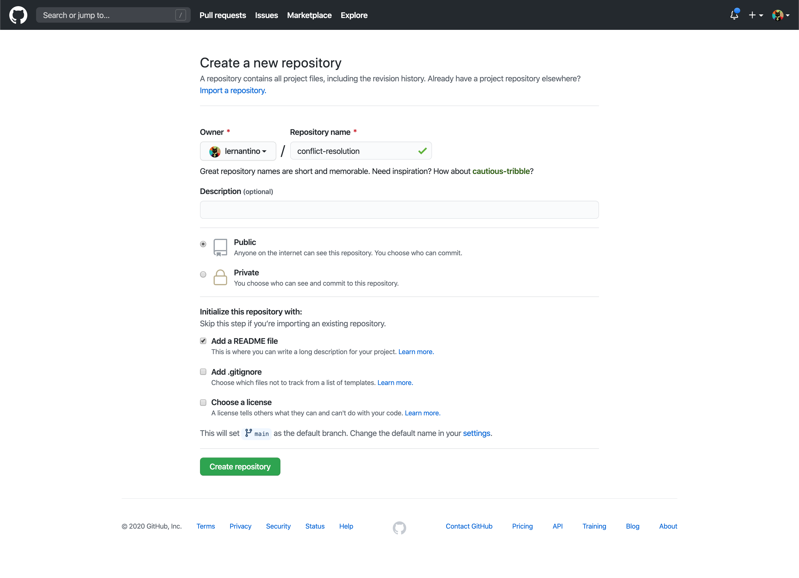
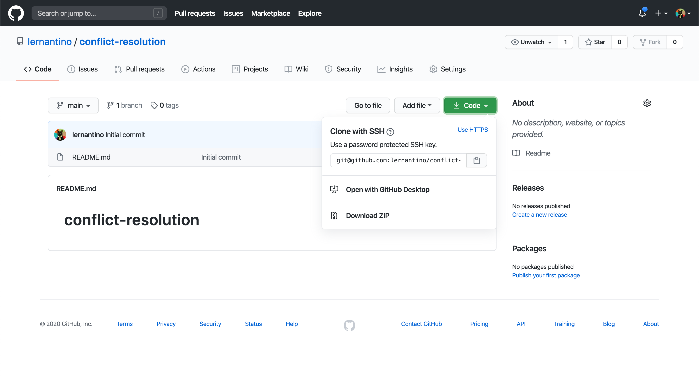
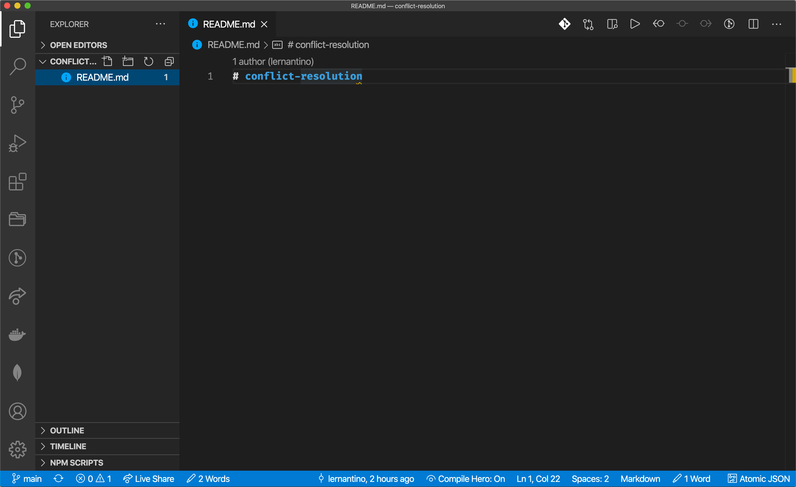
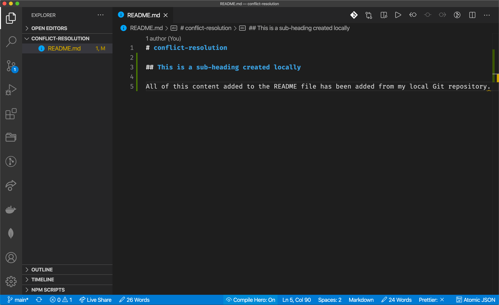
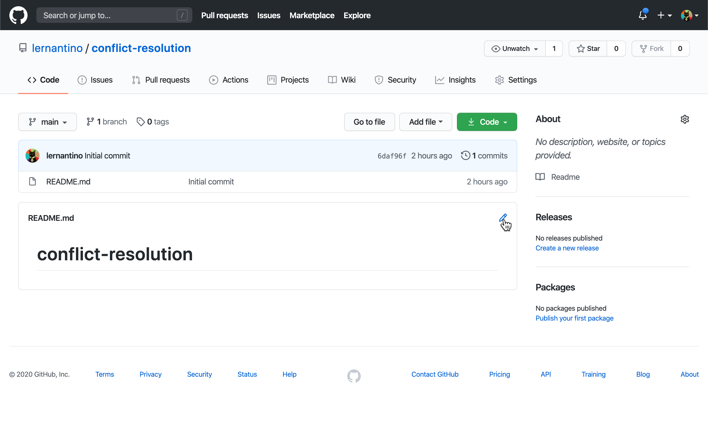
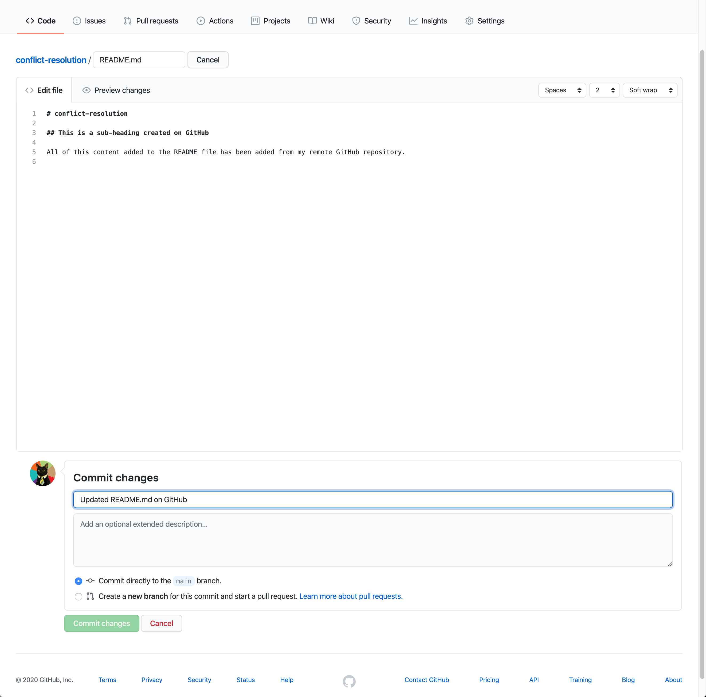
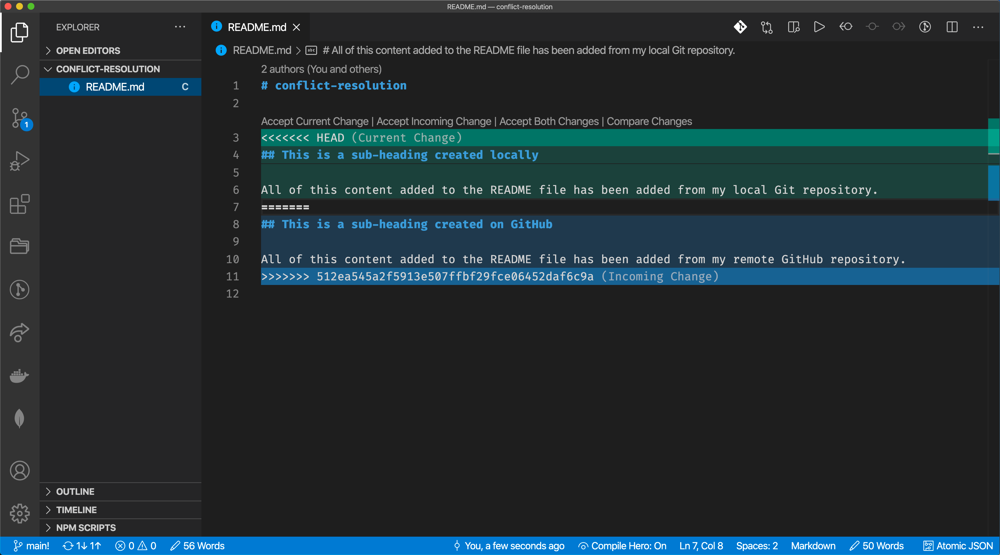
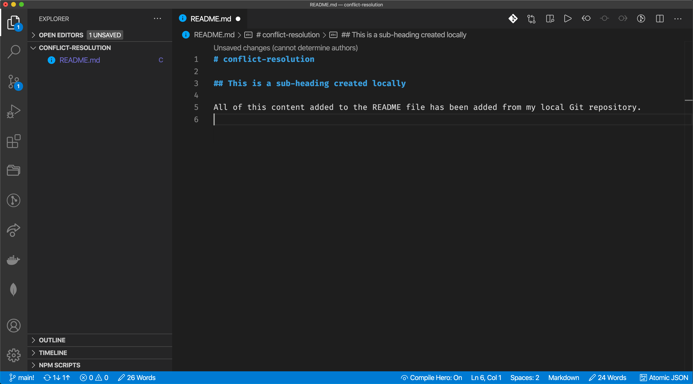

# Git Pull and Merge Conflicts

In this activity, we will walk through a situation to learn about merge conflicts and how to handle them using Git and GitHub. Merge conflicts arise when one version of your project looks one way and another version looks slightly different, causing Git to prompt you to address and confirm which version is correct so that you can move on.

To learn how to identify and fix merge conflicts, we'll first create a repository on GitHub and clone it to our machines, then we'll force the local and remote (GitHub) repositories to diverge by making changes to the same file in each location. When we try to get them back in sync, we'll be confronted with a merge conflict.

This specific type of conflict is not as common as others you will face throughout your career as a developer. These types of conflicts typically arise when we collaborate with others and the projects become more complex, so this is a good opportunity to learn how conflicts may come about and how we can address them without the increased pressure of a larger application.

## Instructions

### Create and Clone the Repository

* Navigate to your GitHub account and create a new repository on GitHub called `conflict-resolution`. Make sure it's created with a `README.md` file by selecting the "Add a README file" checkbox. The page should look something like the following image:

  

* Now let's clone the newly created repository to the local machine. We can start to do so by clicking the green Code button, selecting the SSH option, and copying the value provided, as the following image shows:

  

* To perform the clone operation, you'll need to use the `git clone` command from your command line. Make sure that you've navigated to the location you want your repository to be cloned to using the `cd` command, and then clone the repo with the following command:

  ```bash
  # replace the last value with the one you copied from your GitHub repository
  git clone git@github.com:lernantino/conflict-resolution.git
  ```

* Once it's done cloning to your machine, navigate to the cloned repository's directory using the `cd` command.

### Update the Local Readme File

* Let's update the project's `README.md` file. Go ahead and open it in your VS Code editor. You should see something like this image with some slight differences depending on your VS Code configuration:

  

* As of right now, there should just be the name of the repository listed using `#`, which is the markdown equivalent of an HTML `<h1>` element. Let's add some more to this file so there's a change to be tracked by Git. Add the following markdown text to the `README.md` file below what's already there:

  ```md
  ## This is a subheading created locally

  All of this content added to the readme file has been added from my local Git repository.
  ```

* The result should look like the following image in VS Code:

  

* Great! Now let's save this work and make a similar update to the readme file through the browser using GitHub.

### Update the Remote Readme File on GitHub

* Now that we've updated the codebase locally by adding to our `README.md` file, let's update that file in a different on GitHub as well. This will force the local repository and the GitHub remote of the repository to have conflicting file histories that we'll have to address soon.

* Navigate to the GitHub repository in your browser, and you'll notice that in the section that displays your `README.md` content, there's a little pencil icon in the upper right corner that will allow you to edit the file directly from GitHub upon click. If you're having trouble locating it, compare your screen to the following image:

  

* Once we enter this edit mode, we can add whatever we need to the `README.md` file, so let's add the following below the content that's already there:

  ```md
  ## This is a subheading created on GitHub

  All of this content added to the readme file has been added from my remote GitHub repository.
  ```

* Notice how the text content is slightly different from what we added locally through VS Code? This will help us differentiate which content came from where when we see our eventual merge conflict.

* Let's commit this change to the GitHub repository, move a bit lower down the page and leave a commit title such as `Updated README.md on GitHub`, and press the Commit Changes button. The page should look like the following image before we press the button:

  

* Upon completion, you'll be brought back to the `README.md` file's view in GitHub so that you can see your updated file.

* Now that we've successfully created two different Git timelines for the `README.md` file, let's try and get them back in sync with on another.

### Create Merge Conflict

* Navigate back to your local Git repository in VS Code and check that the file is saved.

* Once the file is saved, we want to use `git add`  and `git commit` commands from the command-line track and save the local work. If we didn't, we wouldn't be allowed to pull the updated content from GitHub into the local repository, because we haven't committed the changed files. From the repository's location in the command line, enter the following commands:

  ```bash
  # instruct all changed files in this repo to be tracked by git
  git add -A
  # commit our changed files with a message of what has been done
  git commit -m "Updated README.md locally"
  ```

* Once the local work is saved and committed, we now want to attempt to resync the local repo and GitHub repo using the `git pull` command. Remember, the `git pull` command is the command we use when we want to take any updated content from the GitHub repository (known as the remote) and have it applied to the local code. Run the following command from the command line:

  ```bash
  # retrieve all changed content from the `main` branch in our GitHub remote
  git pull origin main
  ```

* Oh no, it seems that we have a merge conflict! The command line should have a message stating that it could not automatically resolve differences between the content in `README.md` and that they will need to be resolved manually.

* What has happened here is that when we run the `git pull` command, we are instructing Git to look at the GitHub remote's content and detect any changes. If it finds any changes, it automatically pulls those changes down to the machine and merges them with the local content. In this case, however, it noticed that the content of `README.md` has changed twice, and it doesn't know which one is correct. 

* This may seem like a problem, but keep in mind that merge conflicts are created by developers. Git is simply pointing out a flaw in the workflow, which is actually useful in terms of helping us figure out what went wrong and how to address it. It's now on us to determine how to proceed.

  > **Important:** Merge conflicts will happen&mdash;it's a fact of life in development. Keep in mind that it's typically an easily fixed issue, as long as no one panics and does something hasty. In these situations, take a step back and address the files that have conflicts, address them, and then use your Git commands to save and commit the updated changes. Never commit code with a merge conflict if possible; it will make it difficult to address at a later date.

### Resolve Merge Conflict

* VS Code makes it easy for us to find and identify where merge conflicts occur. Let's open it back up to view the `README.md` file again. We should see something like the following image:

  

* Notice the interesting syntax added to the file? That's added by Git when there's a conflict. It first lists what code is in the `HEAD`, which is their way of saying the most up-to-date content that's local. Then, after the dividing line of equal signs (`=======`) is the `Incoming Change`, which came from the GitHub remote when we ran `git pull`. 

  > **Important:** VS Code adds in the extra color block highlighting and options. If you weren't using VS Code, it might be a more manual process to address the conflicting code. 

* Now this is where you, the developer, need to make a decision: which block of code is correct?

* There isn't one clear answer to this, so it's important that you critically think about each block and decide which one is to be kept. If you're on a team working on this, it's doubly important that you communicate the conflict to them and come to a decision together. You can even choose to keep both blocks of code if you feel it's correct, though that is unlikely to happen.

* Once you have determined which content should remain, you can use VS Code's options to Accept Current Change (which is what you have locally), Accept Incoming Change (which is what came from the GitHub repository), or Accept Both Changes (which will merge both together). For this case, let's choose the first option, to Accept Current Change. The result should look like the following image:

  

* Great, you just handled a merge conflict! All you have to do now is save your file, commit the fixed code, and push it to GitHub, using the following commands:

  ```bash
  git add -A
  git commit -m "fix conflict in README"
  git push origin main
  ```

* To recap what happened here, we purposely created a diverging timeline for the content in the `README.md` file. When we attempted to sync the two, Git didn't know which one was correct, so it prompted us that there was a conflict and we must resolve it. Upon resolution, we committed and pushed the code and could move on with our work.

* As it's been said, merge conflicts come with the territory of using version control and working with others on an application. Despite the negative term "conflict," it's actually a good thing that Git warns us and prompts us to do something about it, because it would be a bad situation if Git just automatically merged everything together or overwrote content we didn't want to use anymore.

* The most important thing to take away from handling merge conflicts is that you will get through it with patience. Take a minute to diagnose where things went wrong and decide how you want to handle it. It will also help to identify any problems with your overall workflow if you continuously run into merge conflicts, as it means there is poor communication and organization among you and your team.

### Hints

* Ask an instructor or TA if you get stuck or have any questions!

* Check the [Atlassian guide on Git merge conflicts](https://www.atlassian.com/git/tutorials/using-branches/merge-conflicts) for reference.

---
© 2022 edX Boot Camps LLC. Confidential and Proprietary. All Rights Reserved.
